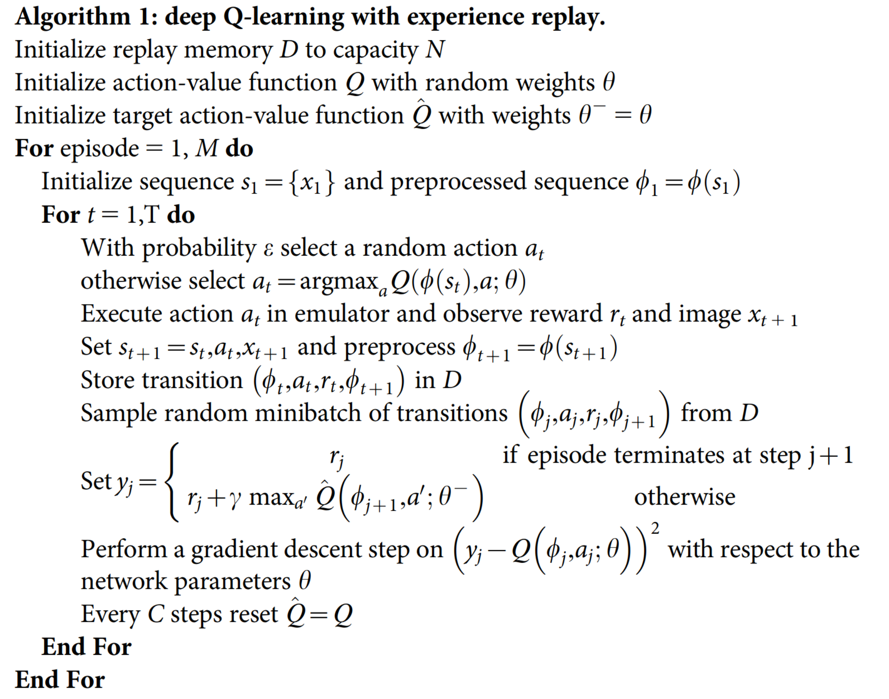
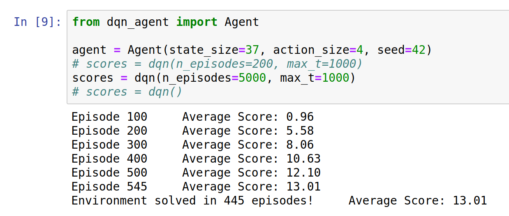
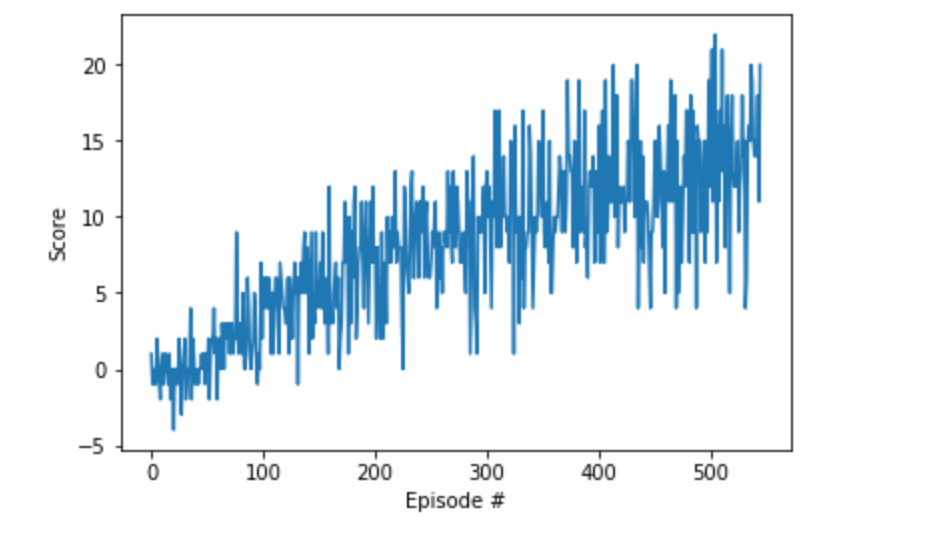
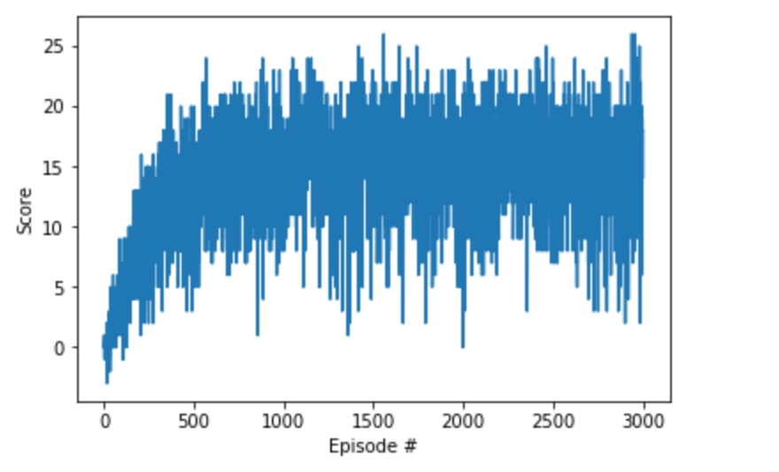

```{r setup, include=FALSE}
knitr::opts_chunk$set(echo = FALSE,message = FALSE,warning = FALSE)
```


# Description

This document is a report describing the learning algorithm and details of implementation, along with ideas for future work.

\pagebreak 

# Algorithm: DQN and Q-Learning

The algorithm used is called `DQN`, where a neural network is used is to implement the `Q-Learning` Algorithm. The `Q-Learning` algorithm attempts to estimate action-value pairs in order to maximize the expected total reward and, therefore, to obtain the optimal policy for the given task. 

The `Q-Learning` algorithm belongs to class of value-based methods, whose goal is to solve the [bellman equation](https://en.wikipedia.org/wiki/Bellman_equation). Solving the bellman equation gives us the optimal policy, given that our environment meets certain criteria in our Markov Decision Process setting. For `Q-Learning` in particular the equation we're trying to solve is as follows

$$
\displaystyle Q^{new}(s_{t},a_{t})\leftarrow \underbrace {Q(s_{t},a_{t})} _{\text{old value}}+\underbrace {\alpha } _{\text{learning rate}}\cdot \overbrace {{\bigg (}\underbrace {\underbrace {r_{t}} _{\text{reward}}+\underbrace {\gamma } _{\text{discount factor}}\cdot \underbrace {\max _{a}Q(s_{t+1},a)} _{\text{estimate of optimal future value}}} _{\text{new value (temporal difference target)}}-\underbrace {Q(s_{t},a_{t})} _{\text{old value}}{\bigg )}} ^{\text{temporal difference}} 
$$

So in a given time step `t` we search for the action that maximizes the action-value pair $Q(s_{t+1},a)$ in order to estimate the optimal future value. DQN uses neural networks to step up from the traditional tabular method approach to the function approximation approach, which means that instead of storing the q-values in a table, we're going to encode it in a **parametrized** function approximator (parametrization what turn the q-value from $q(s,a)$ to $q(s,a;\theta)$). This gives us a lot flexibility to solve many other problems, specially those whose state space is continuous.

The figure bellow is the `DQN` implementation proposed in the [nature paper](https://storage.googleapis.com/deepmind-media/dqn/DQNNaturePaper.pdf). In that implementation there are two important additional tricks. Those tricks are employed in order to solve some instability that the neural network suffers in training. The first is experience replay and the second is the fixed q-targets.

Experience replay is mainly just creating a buffer to store some events (the $(S_{t},A_{t},R_{t},S_{t+1})$ action-pairs) and then latter using mini-batches of them to run gradient descent and learn the network weights. 

Fixed q-targets is a technique used to avoid a difficulty found in Q-Learning, where we update a guess with a guess, which can potentially lead to harmful correlations. In Q-Learning after each pass our neural network tries to get as close as possible to the target q-values, but the problem is that because we update the weights after each forward pass, our q-value target to calculate the loss function is always changing and that makes learning a bit unstable. To solve this problem the idea is to store the weights in another neural network $\hat{q}$ (called target network), freeze $\hat{q}$ the weights and update them every once in a while. Now when performing the learning step, our q-value loss function is the deviation from the forward pass calculated $q$ and the target (fixed) $\hat{q}$ value. That means that out "ground-truth" response variable is the fixed q-value from the target network and that makes learning more stable. 



\pagebreak

# Coding the Algorithm

The code implementation of the algorithm used here is mostly inspired the by "Lunar Landing" project notebook provided by `Udacity`, in the "Value-Based" section. Here is a brief description of the files:

- **Navigation.ipynb**: a jupyter notebook that serves as a wrapper of smaller functions. This is the main file, responsible for: 1) starting the environment; 2) loading the neural network architecture in `model_py`; 3) loading the `dqn_agent` implementation with fixed q-targets and experience replay.

- **model.py**: this is where the neural network architecture is stored, written in `pytorch`.

- **dqn_agent.py**: this is code that implements the `DQN` high-level ideas of fixed q-targets and experience replay. 

- **checkpoint.pth**: this is the `DQN` model weights used to solve the environment **with** early stopping (which means that if achieve the average score of +13 over 100 episodes than we finish learning).

- **checkpoint_no_callback.pth**: this is the `DQN` model weights used to solve the environment **without** early stopping (which means that even if achieve the average score of +13 over 100 episodes, we still continue learning until we hit the total number of episodes specified).

## Comments on `model.py`

The `model.py` file contains the pytorch model architecture used to solve the environment. The architecture used is a simple 2 fully connected layer with RELU activation function. The input size that the network expects is the 37 dimension array corresponding to the state space size, while the output layer is a simple linear layer with output size of 4 which corresponds to the 4 actions available (forward,backward,left,right).

## Comments on `dqn_agent.py`

The `model.py` file contains:

- the `hyperparameters` used: 
    - `BATCH_SIZE = 64`: neural network mini-batch size
    - `GAMMA = 0.99`: the discount factor used in the discounted sum of rewards
    - `TAU = 1e-3`: the $\tau$ parameter used to soft update of target parameters
    - `LR = 5e-4`: the neural network learning rate use in gradient descent
    - `UPDATE_EVERY = 4`: how often to update the network
    - `BUFFER_SIZE = 1e5`: replay buffer size (how much we store into the replay buffer)
    
    
- the `Agent` class: 
    - implements the `step`, `act`, `learn` and `soft_updates` methods
    - initializes the policy and target networks for fixed q-target strategy
    - initializes the `ReplayBuffer` class.
    
- the `ReplayBuffer` class: an API to 
    - initialize storage
    - implement the `add` (add new experiences) and `sample` (sample experiences to mini-batch GD learning) methods

\pagebreak

# Results

The `DQN` implementation was able to successfully solve the task of achieving an average score of +13 over 100 episodes in 445 episodes. Its average score was 13.01, as shown in the `Figure 02` bellow. It's important to note that we used a early stopping technique not to go into the 5000 episodes, if not needed. The plot of the scores is shown in `Figure 03` and it suggests that just increasing the number of episodes alone could improve performance.






After seeing the plot shown in `Figure 03` I've tried to improve the agent's performance by just removing the early stopping if-clause and letting the DQN to train the entire 3000 episodes. The results are shown in the `Figure 04` and from it we can see that increasing the number of episodes can only get us so far (because the average score stagnates after about 1000 episodes) and to make the agent learn better we have to try different strategies, as suggest in the section Ideas to Explore Later.


\pagebreak

# Ideas to Explore Later

Some ideas that could lead to improvements in the learning process are trying to:

- Use Double Q-Learning, as presented [here](https://arxiv.org/pdf/1509.06461). The idea is very similar the the DQN, but the Q-learning algorithm is known to overestimate action values under certain conditions and so double Q-learning could lead to better performance.

- Change the neural network architecture. Maybe add a convolutional layer or some dropout and see how things go.

- Try using [prioritized experience replay](https://arxiv.org/pdf/1511.05952) to replay important transitions more frequently, and therefore learn more efficiently.

- Try Dueling DQN, as presented [here](https://arxiv.org/pdf/1511.06581). The idea is to introduce the advantage function as a separate estimator. The main benefit it provides is to generalize learning across actions without imposing any change to the underlying reinforcement learning algorithm. The results displayed in the paper shows that this architecture could lead to better policy evaluation in the presence of many similar-valued actions
    
    
    